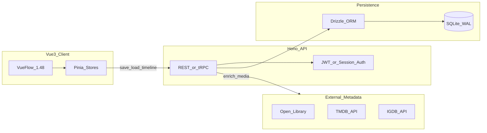
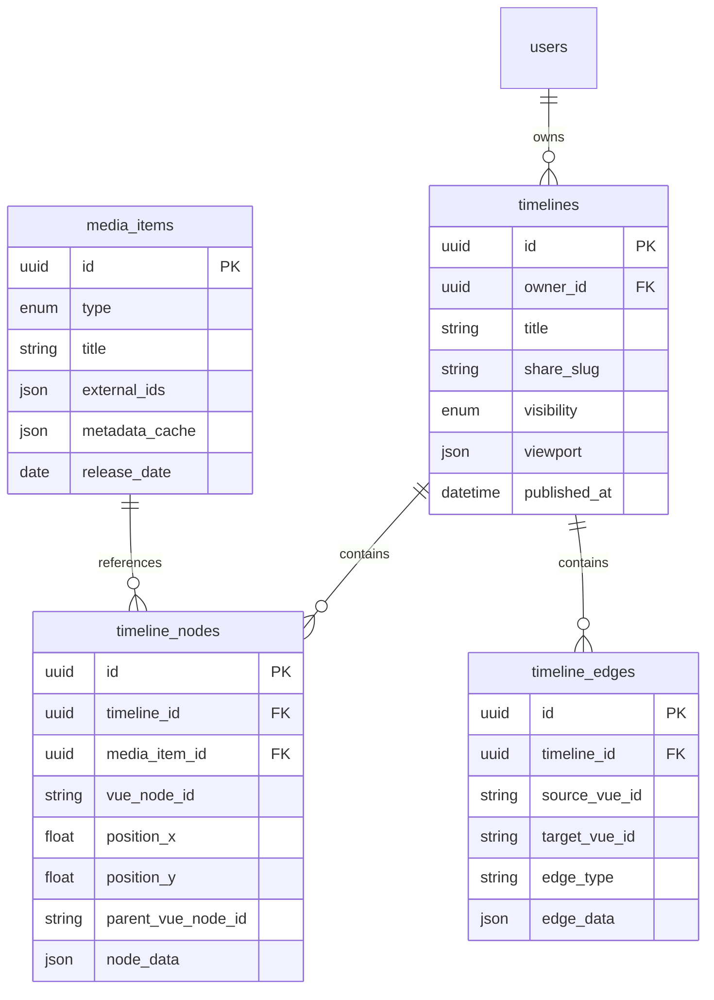

# Literary Timeline Builder: Architecture Plan

> Static reference copy of the original project plan (June 2026).
> For current setup and run instructions, see [README.md](../README.md).

## Overview

Recommend a TypeScript monorepo backend with SQLite (via Drizzle ORM) for an MVP literary timeline builder using Vue Flow 1.48.x, optimized for single-owner editing and read-only public sharing—with a clear migration path to Postgres when scale demands it.

## Your constraints (from answers)

- **Sharing model:** One owner edits; others consume via publish/read-only links
- **Hosting:** Undecided — plan should work self-hosted or on a managed PaaS
- **Frontend:** Vue 3, Pinia, latest Vue Flow (`@vue-flow/core` **1.48.x**)
- **Repo state:** Greenfield ([README.md](README.md) only)

That sharing model is read-heavy and avoids the hardest backend problems (live collaboration, conflict resolution). SQLite is a strong fit here.

---

## Is SQLite appropriate?

**Yes — for this project, especially at MVP and through moderate growth.**

| Factor | Fit for your app |
|--------|------------------|
| Workload | Publish/read-only = mostly reads on shared timelines; writes are per-owner saves |
| Graph data | Vue Flow `nodes` + `edges` serialize cleanly to JSON columns |
| Media metadata | Books/movies/games are reference rows + cached API payloads |
| Multi-user | Many users *reading* the same timeline is fine; SQLite handles concurrent reads well in WAL mode |
| Sharing | Public/unlisted slug URLs need no real-time sync |

**SQLite is a poor primary choice only if you later need:**

- Multiple simultaneous editors on the same timeline with frequent saves
- Real-time live cursors / operational transforms
- Horizontal scaling across many write-heavy app servers
- Heavy full-text search across millions of graph nodes at scale

None of those apply to your stated sharing model.

**Practical SQLite settings for production:**

- Enable **WAL** journal mode
- Run SQLite on **persistent disk** (not ephemeral container FS)
- Use a **single API process** writing to the DB (or connection pooling with one writer)
- Back up the `.db` file (or use [Turso](https://turso.tech/) / [LiteFS](https://fly.io/docs/litefs/) later for replicated SQLite)

**Migration path:** Start with SQLite + [Drizzle ORM](https://orm.drizzle.team/). Drizzle supports SQLite and Postgres with the same schema patterns, so you can swap `better-sqlite3` → `postgres` later without rewriting your domain model.

---

## Recommended backend

### Primary recommendation: **Hono + Drizzle + SQLite (TypeScript monorepo)**



**Why this stack:**

1. **TypeScript end-to-end** — share types between Vue client and API (`Timeline`, `MediaNode`, `VueFlowNode`, `VueFlowEdge`)
2. **Hono** — small, fast, runs on Node, Bun, or edge; easy Docker deploy on Fly/Railway/VPS
3. **Drizzle** — lightweight ORM, excellent SQLite support, painless Postgres migration
4. **Fits Vue Flow** — persist graph state as JSON; validate with Zod on save/load
5. **Publish model** — simple `visibility` + `share_slug` columns; no WebSockets required

**Suggested packages:**

- API: `hono`, `drizzle-orm`, `better-sqlite3`, `zod`, `@hono/zod-validator`
- Auth: `lucia` or `better-auth` (session-based) — avoid rolling your own
- Optional monorepo: `pnpm` workspaces with `apps/web` + `apps/api` + `packages/shared`

### Strong alternative for fastest MVP: **PocketBase**

If you want auth, admin UI, file uploads, and SQLite persistence with almost no backend code:

- PocketBase is **SQLite under the hood**
- Built-in users, collections, file storage, REST + realtime hooks
- Vue client talks to PocketBase SDK directly or via thin proxy
- Tradeoff: less flexible than a custom Hono API; harder to share types; vendor-specific patterns

**Choose PocketBase** if speed-to-demo matters more than long-term API control. **Choose Hono + Drizzle** if you expect custom filtering, media enrichment pipelines, and a clean migration to Postgres.

### Not recommended as primary backend (for your case)

| Option | Why skip (for now) |
|--------|-------------------|
| Supabase/Firebase first | Postgres/BaaS is fine but adds cost/complexity before you need realtime or RLS-heavy multi-tenant editing |
| Python FastAPI | Works, but you lose TS type sharing with Vue unless you codegen OpenAPI |
| Graph DB (Neo4j) | Overkill; Vue Flow + relational/JSON storage handles literary hierarchies well |
| SQLite in the browser only | Cannot support server-side sharing and user accounts without a sync layer |

---

## Data model (aligned with Vue Flow + literary timelines)

Store **domain entities** separately from **canvas layout** where possible. That makes filtering (by media type, era, franchise, tag) independent of x/y positions.



**Design notes:**

- **`vue_node_id`** — stable ID used by Vue Flow (`node.id`); keep it across saves
- **`parent_vue_node_id`** — supports hierarchical grouping (series → installments, universe → works)
- **`media_items`** — canonical book/movie/game record; dedupe by `external_ids` (ISBN, TMDB id, IGDB id)
- **`node_data`** — Vue Flow custom node payload (labels, styling, filter tags) without duplicating full media metadata
- **Publish flow** — set `visibility = 'public'`, generate `share_slug`, snapshot optional `published_graph_json` for immutable public views

**Vue Flow persistence pattern (Pinia → API):**

```ts
// On save: send nodes + edges from useVueFlow() or Pinia store
{
  nodes: Node[],  // id, type, position, parentNode, data
  edges: Edge[],  // id, source, target, type, data
  viewport: { x, y, zoom }
}
```

On load, hydrate Pinia and pass to `<VueFlow :nodes :edges>`. Debounce autosave (e.g. 1–2s) on owner edits; public viewers hit a read-only `GET /timelines/:slug` endpoint.

---

## Filtering strategy

Split filters into two layers:

1. **Graph-level (client-side, fast):** Pinia computed store filters visible nodes/edges by tag, media type, date range — Vue Flow re-renders filtered subsets
2. **Library-level (server-side):** SQL/Drizzle queries on `media_items` and `timeline_nodes` for search, “show all timelines containing X”, user dashboards

For SQLite full-text search on titles/descriptions, add an **FTS5** virtual table later if needed; not required for MVP.

---

## Media enrichment (books, movies, games)

Keep the API responsible for fetching and caching external metadata:

| Type | Suggested source |
|------|------------------|
| Books | [Open Library API](https://openlibrary.org/developers/api) |
| Movies/TV | [TMDB API](https://developer.themoviedb.org/) |
| Games | [IGDB API](https://api-docs.igdb.com/) (via Twitch credentials) |

Flow: user picks or searches media → API fetches once → stores in `media_items.metadata_cache` → timeline nodes reference `media_item_id`. This avoids CORS issues and rate-limit sprawl from the browser.

---

## Hosting options (undecided — ranked by fit)

| Option | Pros | Cons |
|--------|------|------|
| **Fly.io / Railway (Docker)** | Single container with API + SQLite volume; simple ops | You manage backups |
| **VPS (Hetzner, etc.)** | Cheapest long-term, full control | You manage TLS, updates |
| **Turso** | Managed SQLite, edge replicas, Drizzle support | Extra service; slightly different from file-based SQLite |
| **Vercel/Netlify frontend + API elsewhere** | Great DX for Vue static deploy | SQLite must live on API host, not serverless functions |

**Suggested default:** Vue SPA on static hosting + Hono API in Docker on Fly.io or Railway with a **mounted volume** for the SQLite file.

---

## Frontend integration sketch

```
apps/web/
  src/
    components/flow/
      LiteraryTimeline.vue      # <VueFlow> wrapper
      nodes/BookNode.vue
      nodes/MovieNode.vue
      nodes/GameNode.vue
      nodes/GroupNode.vue       # hierarchical parent
    stores/
      timelineStore.ts          # nodes, edges, viewport, save status
      filterStore.ts            # active filters
    composables/
      useTimelinePersistence.ts # load/save debounce
packages/shared/
  types/timeline.ts             # shared with API
```

Use `@vue-flow/core@^1.48.2` plus optional `@vue-flow/background`, `@vue-flow/controls`, `@vue-flow/minimap`.

---

## Suggested implementation phases

### Phase 1 — Local MVP (SQLite proves the model)

- Scaffold Vue 3 + Vite + Pinia + Vue Flow 1.48
- Hono API with Drizzle + SQLite file
- CRUD for timelines; save/load graph JSON
- Custom node types for book/movie/game

### Phase 2 — Sharing

- Auth (register/login)
- `share_slug` + public read-only route
- Optional immutable publish snapshot

### Phase 3 — Discovery and polish

- Media search via external APIs
- Server-side timeline search
- FTS5 if search volume grows

### Phase 4 — Scale (only if needed)

- Migrate Drizzle schema to Postgres
- CDN for published timeline thumbnails
- Background jobs for metadata refresh

---

## Implementation todos (original)

| ID | Task |
|----|------|
| `scaffold-monorepo` | Scaffold pnpm monorepo: apps/web (Vue 3 + Pinia + Vue Flow 1.48), apps/api (Hono), packages/shared (Zod types) |
| `drizzle-schema` | Define Drizzle schema: users, timelines, media_items, timeline_nodes, timeline_edges with share_slug and visibility |
| `vueflow-nodes` | Build custom Vue Flow node components (Book, Movie, Game, Group) and Pinia timelineStore with debounced save |
| `auth-publish` | Add session auth and publish/read-only flow: owner saves, public GET by share_slug |
| `media-enrichment` | Add API routes to search/cache media metadata from Open Library, TMDB, IGDB |

---

## Bottom line

| Question | Recommendation |
|----------|----------------|
| **Backend** | **Hono + Drizzle + SQLite** in a TypeScript monorepo (or **PocketBase** for fastest MVP) |
| **SQLite?** | **Yes** — appropriate for single-owner editing + read-only sharing; use WAL, backups, and Drizzle for an easy Postgres exit ramp |
| **Vue Flow** | `@vue-flow/core` 1.48.x; persist `nodes`, `edges`, `viewport`; use `parentNode` for hierarchy |

No backend or database code exists in the repo yet, so you can adopt this stack cleanly without migration cost.
